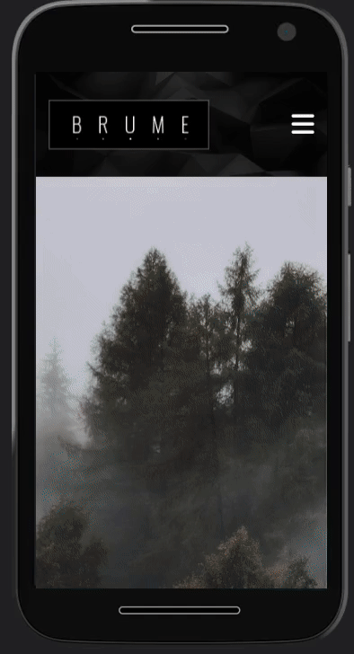

# Brume's template Clone

I came across with a template and i have decided get it in my own way. 

---

## About the HTML and CSS

All the project runs in just one HTML file. But when it comes to css, i've decided use SASS. 
I've use the current syntaxe and correct import's methods file in scss.

*Read more about @use and @foward at the sass's documentation.*

I've split the styled file in components in order to get the project more organized.

The site is fully responsive. Enjoy it.

---

## About JS and Typescript

At this part of the project, i builted up two classes, one to handle the slider element in the site and another to handle the toggle menu.

I've using modules in js, but for some reason i've getting an error on typescript compiler. So, after doing some research about it, i found out that i should've get rid of a option //"module": "commonjs" and set the target to "es6". Then, the problem was solved. :)

### Desktop Version

### Mobile Version 

*I havent cloned the site right the way it was, i've just got inpired and i've decided do it in my way*.

