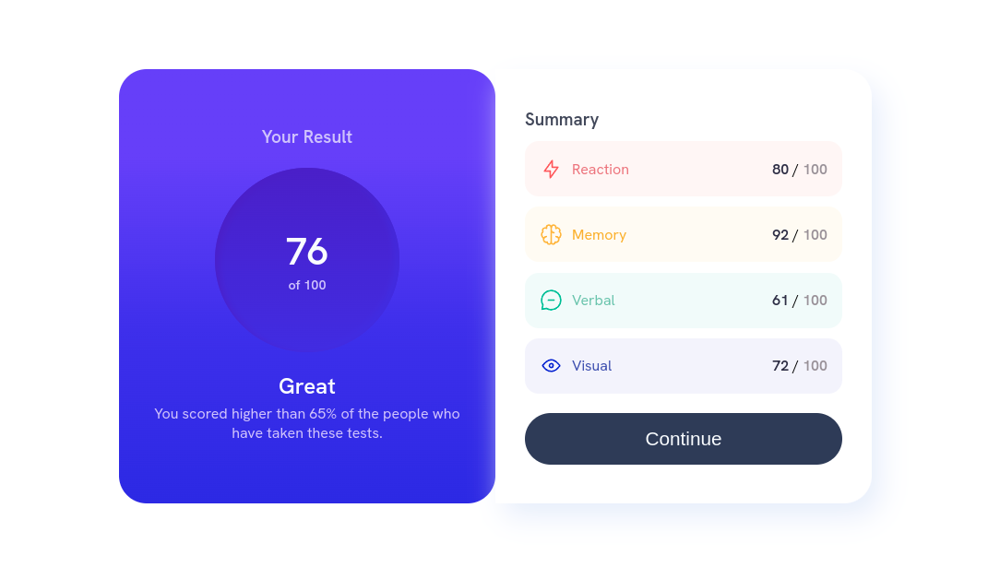
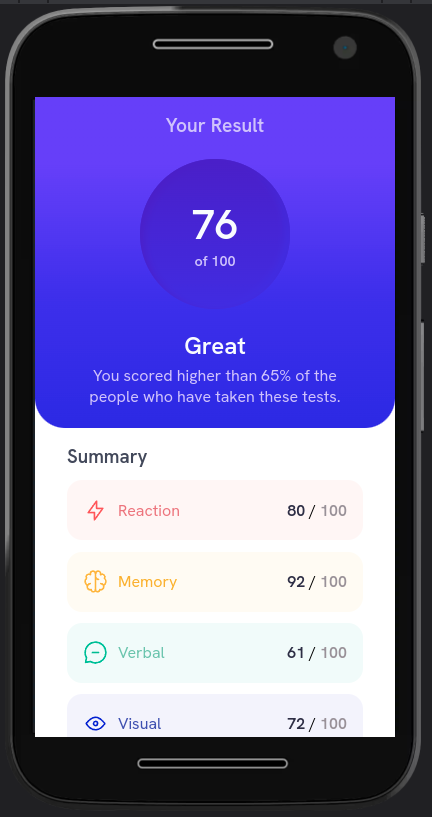
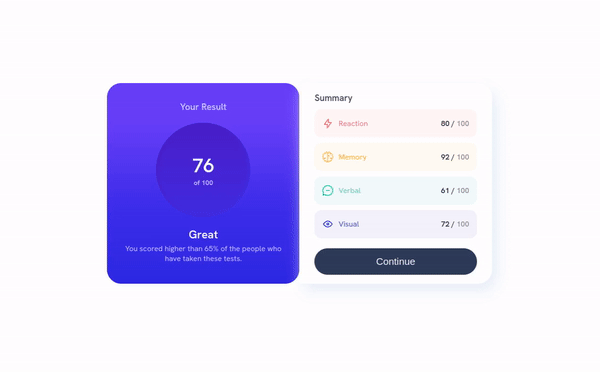

# Challenge from frontendMentor :notebook:

This challenge was great, besides simple it is really beatiful. I build it using the mobile first concept.

I use the scss tecnology to give super powers to my css. 

## This is the desktop version

## This is the mobile version

## Final result

[Check out my linkedin](https://www.linkedin.com/in/anderson-cesar-5418151b3/)

